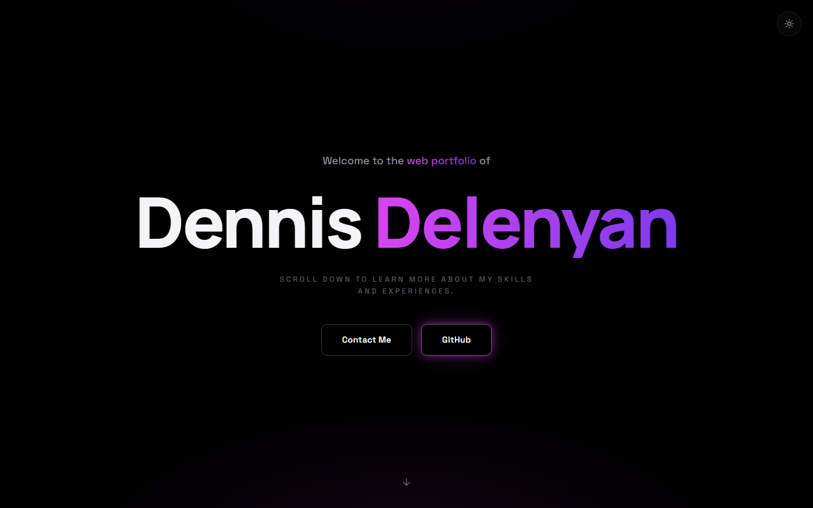

# Dennis Delenyan — Portfolio

Personal portfolio site for Dennis Delenyan: a single-page, dark-first portfolio with a
hero, about, projects, and contact section. Project cards can pull their details live
from the GitHub API, and the contact form submits through Formspree.

> **Live demo:** https://my-portfolio-two-gules-23.vercel.app

 <!-- replace with a real screenshot -->

## Tech stack

- [React 19](https://react.dev) + [TypeScript](https://www.typescriptlang.org)
- [Vite](https://vite.dev) for dev server and builds
- [Tailwind CSS v4](https://tailwindcss.com) with CSS-variable design tokens (light/dark theming)
- [Framer Motion](https://motion.dev) for subtle scroll reveals and hover effects
- [Formspree](https://formspree.io) for the contact form backend
- GitHub REST API for live project-card data

## Getting started

```bash
npm install
npm run dev      # local dev server
npm run build    # type-check + production build
npm run preview  # serve the production build locally
```

## Contact form

The form posts to [Formspree](https://formspree.io); the form ID lives in
`src/scripts/site.ts` (`formspreeId`). The ID is public by design — it's visible in
the browser's network requests either way, and Formspree's spam protection plus the
form's honeypot field handle abuse. To point at a different form, just change the ID.
If `formspreeId` is ever emptied, the form degrades gracefully and tells visitors to
use email instead.

## Editing content

All personal data (name, email, GitHub user, LinkedIn URL) and the project list live in
[`src/scripts/site.ts`](src/scripts/site.ts). To add a project card, append an entry to
the `projects` array — give it `repo: "owner/name"` to pull its name, description,
language, and link live from the GitHub API, or fill in the fields manually for
anything not on GitHub.

## Deploying to Vercel (free)

1. Push this repo to GitHub.
2. Go to [vercel.com/new](https://vercel.com/new) and import the repo — Vercel
   auto-detects Vite, no configuration needed.
3. Deploy. Afterwards, update the Open Graph URLs in `index.html` and the
   live-demo link above with your real domain.

The site is already connected this way — every push to `main` deploys automatically.
